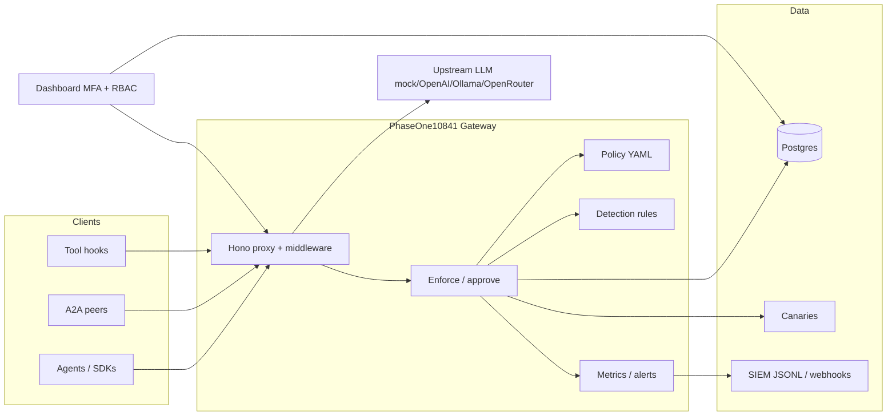

# PhaseOne10841 — Defensive Agent Security Gateway (Agent EDR)

**phaseone-core v0.4.0**

Watches autonomous agents the way CrowdStrike watches endpoints — **outside** the agent, not via prompt-only hope.

> **DEFENSIVE ONLY.** No exploit PoCs, attack payloads, malware, or offensive tooling. The lab uses inert fixtures and detectors only.

**A product of [Veracity Integrity LLC](https://VeracityIntegrity.com)** · https://VeracityIntegrity.com  
Website concept: [PhaseOne10841.me](https://phaseone10841.me)

> **Repository access:** The PhaseOne10841 product repository is **private** (commercial / licensed distribution). Contact Veracity Integrity LLC via https://VeracityIntegrity.com for access, evaluation, or deployment support. This README documents the software as shipped to authorized operators.

---

## What it is

PhaseOne10841 is a **defensive Agent EDR / security gateway** for LLM agents and agent frameworks. It sits in the path of:

- OpenAI-compatible chat completions
- Tool calls (HTTP, filesystem, shell, MCP)
- Agent-to-agent (A2A) messages
- Untrusted tool / RAG / MCP results

…and applies **policy enforcement, recording, detection, human approval, canaries, SIEM export, metrics, and alerts** — without requiring the agent itself to “behave.”

### Who it’s for

| Audience | Use |
|----------|-----|
| **Security / platform teams** | Put a control plane in front of agents before production tool access |
| **AI engineering leads** | Route LangChain / CrewAI / OpenAI SDK traffic through a single gateway |
| **SOC / detection engineers** | Consume JSONL / webhooks / Prometheus metrics; tune YAML detection rules |
| **Compliance / risk** | Audit admin actions, approvals, session replay, secret egress blocks |

---

## Architecture



**Security model:** Enforcement lives **outside** the model. Agents cannot “talk their way” past gateway deny/approval/canary checks. Prompts are scanned; tools are evaluated against YAML policy; high-severity events can page a webhook.

---

## Features by phase

### Phase 1 — Core gateway
- OpenAI-compatible `/v1/chat/completions` proxy
- YAML policy (domains default-deny, shell deny-by-default, FS roots, destructive → approval)
- Postgres event recorder + sessions
- Harmless canary markers + detector
- Basic dashboard

### Phase 2 — Agent defenses
- Prompt-injection scanner (source-classified)
- Tool Permission Analyzer
- A2A firewall (trust levels)
- Lab harness (inert stubs + labeled fixtures)

### Phase 3 — Operations
- Terminal `npm run onboard`
- MFA admin console (email OTP)
- Approval UX + timeout / expire
- SIEM ECS-ish JSONL + webhook
- Secret-egress hardening + deep redaction
- MCP allowlist on `mcp_call`
- Deep session replay
- Policy editor (safe YAML)

### Phase 4 — Product hardening (this release)
| Feature | Behavior |
|---------|----------|
| **Admin audit log** | Login, approve/deny, policy save, export, settings, canary rotate, A2A trust — actor email + timestamp; UI + API |
| **Policy save path** | Validated YAML; backup previous version; reject invalid / disallowed keys |
| **Detection rules engine** | Sigma-ish YAML in `rules/`; match tool/domain/injection/canary/A2A fields; dashboard list + hit counts |
| **Canary management** | List, safely rotate markers, show last trigger |
| **A2A trust admin** | List/set trust levels via API + settings UI |
| **Health & readiness** | `/healthz`, `/readyz` on gateway + dashboard; Compose healthchecks |
| **Prometheus metrics** | `/metrics` counters: blocks, injections, canaries, approvals, A2A, alerts, rules |
| **Framework adapters** | OpenAI-compatible helper + stubs/docs for LangChain, CrewAI, Claude-style tool proxy |
| **Alerting** | Webhook on canary / injection blocked / approval timeout with retry + exponential backoff |
| **Onboard** | Phase 4 env: alert webhook, rules dir, metrics, viewer emails |
| **RBAC lite** | `PHASEONE_ADMIN_EMAILS` (mutate) vs `PHASEONE_VIEWER_EMAILS` (read-only) |

---

## Quick start

### 1. Onboard (recommended)

```bash
npm install
npm run onboard                 # interactive — Veracity Integrity banner
# or CI / non-interactive:
npm run onboard -- --defaults
```

Writes `.env` with MFA emails, SMTP or OTP fallback, DB, session secret, upstreams, SIEM, **alert webhook**, **rules dir**, **viewer emails**, ports.

### 2. Compose

```bash
docker compose up --build
```

| Service | URL |
|---------|-----|
| Gateway | http://localhost:8080 |
| Dashboard | http://localhost:3000 |
| Postgres | localhost:5432 (`phaseone` / `phaseone` / `phaseone`) |

```bash
curl -s http://localhost:8080/healthz
curl -s http://localhost:8080/readyz
curl -s http://localhost:8080/metrics | head
curl -s http://localhost:3000/healthz
```

### 3. MFA login (dashboard)

1. Open http://localhost:3000  
2. Enter an allowlisted **admin** or **viewer** email  
3. **Send code** → read OTP from logs / `PHASEONE_OTP_FALLBACK_FILE` if SMTP unset  
4. Enter code → console (viewers are read-only)

Disable auth for local demos only: `PHASEONE_DASHBOARD_AUTH=false` (not recommended).

### 4. Tests (no Docker required)

```bash
npm install
npm test
```

### 5. Lab / permissions

```bash
npm run lab
npm run permissions
```

---

## Configuration reference

Prefer `npm run onboard`. Key variables (see `.env.example`):

| Variable | Purpose |
|----------|---------|
| `PHASEONE_ADMIN_EMAILS` | Comma-separated admins (full access) |
| `PHASEONE_VIEWER_EMAILS` | Comma-separated viewers (read-only) |
| `PHASEONE_DASHBOARD_AUTH` | `true`/`false` |
| `PHASEONE_SESSION_SECRET` | Session signing material (auto-generated by onboard) |
| `PHASEONE_OTP_FALLBACK_FILE` | Dev OTP log path when SMTP unset |
| `SMTP_*` | Optional OTP email delivery |
| `DATABASE_URL` | Postgres |
| `UPSTREAM_PROVIDER` | `mock` \| `openai` \| `ollama` \| `openrouter` |
| `GATEWAY_PORT` / `DASHBOARD_PORT` / `GATEWAY_URL` | Ports / dashboard→gateway |
| `PHASEONE_APPROVAL_TIMEOUT_MS` | Approval wait/expire |
| `PHASEONE_SIEM_WEBHOOK_URL` | SIEM batch webhook |
| `PHASEONE_ALERT_WEBHOOK_URL` | High-severity alert webhook |
| `PHASEONE_ALERT_MAX_RETRIES` | Alert retry count (default 3) |
| `PHASEONE_ALERT_BASE_DELAY_MS` | Alert backoff base (default 250) |
| `PHASEONE_RULES_DIR` | Detection rules directory (default `./rules`) |
| `PHASEONE_METRICS_ENABLED` | Metrics flag (scraped via `/metrics`) |
| `PHASEONE_POLICY_PATH` | Override policy YAML path |

---

## Policy, rules, canaries, A2A, SIEM, metrics, alerts

### Policy (`policy/default-policy.yaml`)

- Domains allowlist / default-deny · Shell deny-by-default · FS roots  
- Secrets / canaries block-on-detect · MCP server allowlist + deny_tools  
- Destructive → human approval · `approval.timeout_ms`  
- `siem`, `prompt_injection`, `a2a`, `permission_analyzer`  
- Admin save validates known keys only and **backs up** the previous file under `policy/backups/`

### Detection rules (`rules/*.yaml`)

Lightweight Sigma-ish rules matching event fields (`event_type`, `tool_name`, `decision`, `injection_score`, `a2a_trust`, etc.).

```bash
curl -s http://localhost:8080/v1/phaseone/rules
curl -s http://localhost:8080/v1/phaseone/rules/evaluate \
  -H 'content-type: application/json' \
  -d '{"event_type":"canary.trigger"}'
```

### Canaries

Harmless fake markers under `canaries/files/`. Detection fires when values appear in tool args/egress. Phase 4 adds list/rotate/last-trigger:

```bash
curl -s http://localhost:8080/v1/phaseone/canaries/manage
curl -s http://localhost:8080/v1/phaseone/canaries/rotate \
  -H 'content-type: application/json' \
  -d '{"canary_id":"canary-aws-production-key-v1"}'
```

### A2A trust

```bash
curl -s http://localhost:8080/v1/phaseone/a2a/trust
curl -s http://localhost:8080/v1/phaseone/a2a/trust \
  -H 'content-type: application/json' \
  -d '{"agent_id":"peer-1","trust":"LOCAL-TRUSTED","persist":true}'
```

### SIEM

```bash
curl -s 'http://localhost:8080/v1/phaseone/export/events.jsonl?limit=100'
curl -s http://localhost:8080/v1/phaseone/export/webhook \
  -H 'content-type: application/json' \
  -d '{"url":"https://siem.example/hooks/phaseone"}'
```

### Metrics & alerts

```bash
curl -s http://localhost:8080/metrics
curl -s http://localhost:8080/v1/phaseone/alerts/config
```

Alerts fire (when `PHASEONE_ALERT_WEBHOOK_URL` is set) on **canary**, **injection blocked**, and **approval timeout**, with retry/backoff.

### Audit log

```bash
curl -s http://localhost:8080/v1/phaseone/audit
```

---

## Dashboard overview

Behind MFA: **Overview · Incidents · Approvals · Session replay · Agents · Canaries · Injections · A2A trust · Permissions · Policy editor · Detection rules · Audit log · SIEM export · Lab monitor · Settings**

- **Admins** can approve/deny, save policy, rotate canaries, set A2A trust, test alerts  
- **Viewers** see the same read APIs but mutating routes return `403`

---

## Point agents through the proxy

### OpenAI-compatible (supported)

```ts
import OpenAI from 'openai';

const client = new OpenAI({
  baseURL: 'http://localhost:8080/v1',
  apiKey: 'unused-for-mock',
  defaultHeaders: {
    'X-PhaseOne-Agent-Id': 'my-agent',
    'X-PhaseOne-Session-Id': crypto.randomUUID(),
  },
});
```

Helpers live in `adapters/` (OpenAI-compatible + stubs for LangChain, CrewAI, Claude-style tool proxy). See `adapters/README.md`.

| `UPSTREAM_PROVIDER` | Notes |
|---------------------|--------|
| `mock` (default) | Inert local echo — no API key |
| `openai` | `OPENAI_API_KEY` + `OPENAI_BASE_URL` |
| `ollama` | `OLLAMA_BASE_URL` |
| `openrouter` | `OPENROUTER_API_KEY` + `OPENROUTER_BASE_URL` |

### Useful APIs

```bash
# Session replay
curl -s http://localhost:8080/v1/phaseone/sessions/<id>/replay

# Tool enforce
curl -s http://localhost:8080/v1/phaseone/tools/enforce \
  -H 'content-type: application/json' \
  -d '{"agent_id":"my-agent","tool_name":"delete_file","arguments":{"path":"/tmp/x"},"wait_for_approval":false}'

# Health
curl -s http://localhost:8080/healthz
curl -s http://localhost:8080/readyz
```

---

## Lab (defensive only)

`lab/` provides **inert** fake services and labeled `PHASEONE_TEST_*` fixtures so detectors can be exercised without real attacks or exploit recipes. See `lab/README.md`.

> Attack simulators and offensive labs are **out of scope**.

---

## OWASP Agentic themes (high level)

PhaseOne maps to common agentic risk themes at a **defensive control** level (no attack recipes):

| Theme | PhaseOne control |
|-------|------------------|
| Prompt injection / untrusted content | Scanner + optional block; scan tool/RAG/MCP results |
| Excessive agency / over-permissioned tools | Permission Analyzer; policy allow/deny; destructive → approval |
| Sensitive data / credential leakage | Secret egress patterns; redaction in recorder/SIEM; canaries |
| Insecure plugin / MCP use | MCP server + tool allowlists on `mcp_call` |
| Agent-to-agent trust | A2A firewall with trust levels + injection scan |
| Insufficient monitoring | Event store, session replay, audit log, metrics, alerts, SIEM |

---

## Development & testing

```bash
npm install
npm test                 # vitest — unit tests, no Docker
npm run build            # tsc
npm run migrate          # apply db/migrations/*.sql
npm run dev:gateway
npm run dev:dashboard
```

Layout:

```
PhaseOne10841ME/
  scripts/onboard.ts
  gateway/             # proxy + enforce + phase3/phase4 routes
  policy/              # YAML + engine + backups/
  rules/               # Sigma-ish detection rules
  recorder/            # Postgres + export + timeline
  canaries/            # markers + detector + manager
  dashboard/           # MFA UI + RBAC
  adapters/            # framework stubs
  lab/                 # inert fixtures
  shared/              # secrets, metrics, audit, rbac, alerting, policy-save
  db/migrations/       # 001_init + 002_phase3 + 003_phase4
  tests/
```

---

## What works vs stubbed

| Feature | Status |
|---------|--------|
| Onboard + MFA + RBAC lite | **Works** (Phase 4) |
| Audit log, rules, metrics, alerts, canary rotate | **Works** (Phase 4) |
| SIEM JSONL + webhook, deep replay, approval timeout | **Works** (Phase 3) |
| Chat proxy + policy + canaries/secrets | **Works** |
| Injection / permissions / A2A / lab | **Works** (Phase 2) |
| Framework adapters | **OpenAI works**; LangChain/CrewAI/Claude = docs + thin stubs |
| In-process OS syscall interception | **Stubbed** — use `/v1/phaseone/tools/enforce` |
| Full MCP wire proxy | **Stubbed** — `mcp_call` enforce + lab fake-mcp |
| Attack simulator / offensive labs | **Out of scope** |

---

## Roadmap (indicative)

- Richer rule language (aggregations, time windows)  
- Deeper framework SDKs (official LangChain / CrewAI packages)  
- Optional signed canary packages for production deployments  
- Multi-tenant org controls beyond email allowlists  
- Hardened SMTP/OIDC SSO for enterprise MFA  

Roadmap items are aspirational and may change; contact Veracity Integrity LLC for commercial roadmap discussions.

---

## License & company

MIT — Copyright (c) 2026 **Veracity Integrity LLC** — see `LICENSE`.

**https://VeracityIntegrity.com**

Product concept site: https://phaseone10841.me  

Private product repository — distribution to authorized customers and partners only.
