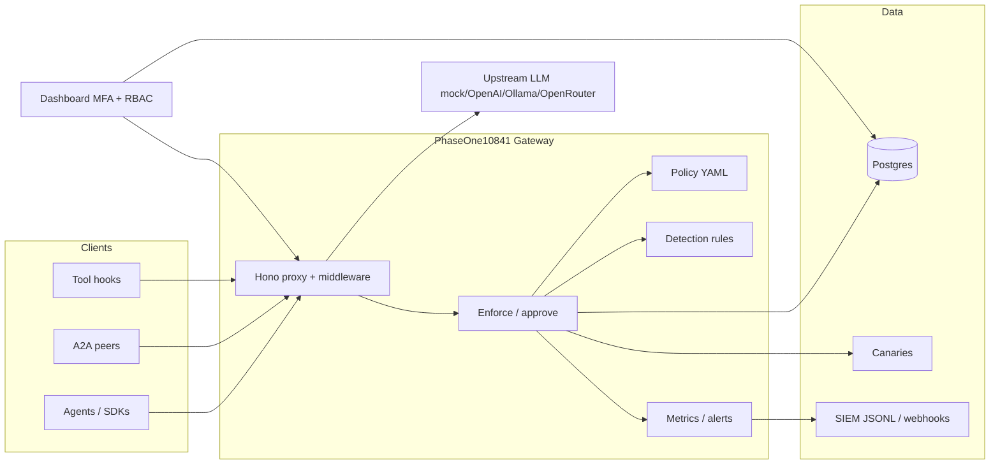

# PhaseOne10841 — Defensive Agent Security Gateway (Agent EDR)

**phaseone-core v0.8.0** (Phase 8 Waves A–C)

Watches autonomous agents the way CrowdStrike watches endpoints — **outside** the agent, not via prompt-only hope.

> **DEFENSIVE ONLY.** No exploit PoCs, attack payloads, malware, or offensive tooling. The lab uses inert fixtures and detectors only.

**A product of [Veracity Integrity LLC](https://VeracityIntegrity.com)** · https://VeracityIntegrity.com  
Website concept: [PhaseOne10841.me](https://phaseone10841.me)

> **Public source:** This repository is **public** at [github.com/veracitylife/PhaseOne10841-VI](https://github.com/veracitylife/PhaseOne10841-VI). Commercial support, deployment help, and implementation services are available from Veracity Integrity LLC via https://VeracityIntegrity.com.

---

## What it is

PhaseOne10841 is a **defensive Agent EDR / security gateway** for LLM agents and agent frameworks. It sits in the path of:

- OpenAI-compatible chat completions
- Tool calls (HTTP, filesystem, shell, MCP)
- Agent-to-agent (A2A) messages
- Untrusted tool / RAG / MCP results

…and applies **policy enforcement, recording, detection, human approval, canaries, SIEM export, metrics, and alerts** — without requiring the agent itself to “behave.”

### Who it’s for

| Audience | Use |
|----------|-----|
| **Security / platform teams** | Put a control plane in front of agents before production tool access |
| **AI engineering leads** | Route LangChain / CrewAI / OpenAI SDK traffic through a single gateway |
| **SOC / detection engineers** | Consume JSONL / webhooks / Prometheus metrics; tune YAML detection rules |
| **Compliance / risk** | Audit admin actions, approvals, session replay, secret egress blocks |

---

## Architecture



**Security model:** Enforcement lives **outside** the model. Agents cannot “talk their way” past gateway deny/approval/canary checks. Prompts are scanned; tools are evaluated against YAML policy; high-severity events can page a webhook.

---

## Features by phase

### Phase 1 — Core gateway
- OpenAI-compatible `/v1/chat/completions` proxy
- YAML policy (domains default-deny, shell deny-by-default, FS roots, destructive → approval)
- Postgres event recorder + sessions
- Harmless canary markers + detector
- Basic dashboard

### Phase 2 — Agent defenses
- Prompt-injection scanner (source-classified)
- Tool Permission Analyzer
- A2A firewall (trust levels)
- Lab harness (inert stubs + labeled fixtures)

### Phase 3 — Operations
- Terminal `npm run onboard`
- MFA admin console (email OTP)
- Approval UX + timeout / expire
- SIEM ECS-ish JSONL + webhook
- Secret-egress hardening + deep redaction
- MCP allowlist on `mcp_call`
- Deep session replay
- Policy editor (safe YAML)

### Phase 4 — Product hardening
| Feature | Behavior |
|---------|----------|
| **Admin audit log** | Login, approve/deny, policy save, export, settings, canary rotate, A2A trust |
| **Policy save path** | Validated YAML; backup previous version; reject invalid / disallowed keys |
| **Detection rules engine** | Sigma-ish YAML in `rules/` |
| **Canary management** | List, safely rotate markers, show last trigger |
| **A2A trust admin** | List/set trust levels via API + settings UI |
| **Health & readiness** | `/healthz`, `/readyz`; Compose healthchecks |
| **Prometheus metrics** | `/metrics` |
| **Framework adapters** | OpenAI-compatible + stubs for LangChain, CrewAI, Claude-style |
| **Alerting** | Webhook on canary / injection blocked / approval timeout |
| **RBAC lite** | Admin vs viewer emails |

### Phase 5 — Deployable local product
| Feature | Behavior |
|---------|----------|
| **OpenAPI** | [`docs/openapi.yaml`](docs/openapi.yaml) covering gateway + admin auth surface |
| **Rate limiting** | OTP request limits; API abuse limits on public-ish endpoints; documented in [`docs/operations.md`](docs/operations.md) |
| **Retention & cleanup** | `npm run retention` (+ onboard env `PHASEONE_RETENTION_DAYS`) |
| **Backup / restore** | `npm run backup` / `./scripts/restore.sh` — Postgres + policy + rules |
| **Docker harden** | `restart: unless-stopped`, non-root `user: 1000:1000`, extended healthchecks, resource-limit notes |
| **Smoke tests** | `npm run smoke` after `docker compose up` |
| **Admin UX** | Ops / Phase 5 nav: retention, rate limits, cookie/security notes |
| **Security defaults** | Shared security headers + CSP; Secure cookie docs (`PHASEONE_SECURE_COOKIES`) |
| **Adapter docs** | Copy-paste OpenAI / curl / Python “point through PhaseOne” examples |

---


### Phase 6 — Operator UX & Integration
| Feature | Behavior |
|---------|----------|
| **Operator CLI** | Full `phaseone` CLI with 18+ commands: health, smoke, migrate, retention, backup, restore, lab, permissions, rules, compose, gui |
| **CLI commands** | `rules evaluate` — test events against rules; `metrics-sniff` — live metrics sampling |
| **Local GUI** | Browser-based UI at `:8888` via `npm run phaseone -- gui`; runs same command registry |
| **CLI docs** | [`docs/cli.md`](docs/cli.md) — comprehensive command reference |
| **Framework adapters** | LangChain, CrewAI, Claude-style tool-proxy with working examples + enforce wrappers |
| **Richer detection rules** | Aggregation rules (`count`, `distinct_count`, `sum`, `avg`) with time windows |
| **New rules** | `brute-force-attempt`, `rapid-tool-calls`, `multi-domain-access`, `high-injection-average`, `approval-timeout-burst` |
| **OIDC / SSO path** | Enterprise auth via `PHASEONE_OIDC_*` env vars; works alongside email OTP (never weakens MFA default) |
| **Dashboard Phase 6 nav** | CLI docs link, OIDC status, richer rules visibility |

### Phase 7 — Automated Gatekeeper (this release)
| Feature | Behavior |
|---------|----------|
| **Gatekeeper worker** | Automated defense orchestration: Sense → Decide → Act → Learn loop |
| **YAML playbooks** | Playbook-based responses in `playbooks/*.yaml` with tiers (observe, contain, harden) |
| **Playbook tiers** | observe (alert/audit), contain (rate limit, force approval, lower trust), harden (rotate canary, reload rules) |
| **Human confirmation** | Harden-tier actions require explicit admin confirmation (MFA/RBAC) |
| **CLI commands** | `gatekeeper status`, `run`, `dry-run`, `list-playbooks`, `llm-check`, `confirm`, `deny` |
| **Dashboard strip** | Gatekeeper status, pending confirmations, recent actions, runtime overrides |
| **Runtime overrides** | Temporary policy mutations (deny tool/domain, tighten rate limit) with expiration |
| **Dry-run mode** | Safe by default — observe without mutations until ready to activate |
| **LLM advisor** | Optional advisory suggestions via OpenRouter (primary) + Ollama (fallback); LLM advises, playbooks decide |
| **Audit integration** | All auto-actions logged with actor `gatekeeper`; dashboard notifications |
| **Gatekeeper docs** | [`docs/gatekeeper.md`](docs/gatekeeper.md) — comprehensive playbook schema and usage |

---

## Quick start — local Docker (Phase 7)


### 1. Onboard

```bash
npm install
npm run onboard                 # interactive — Veracity Integrity banner
# or CI / non-interactive:
npm run onboard -- --defaults
```

Writes `.env` with MFA emails, SMTP or OTP fallback, DB, session secret, upstreams, SIEM, alerts, rules, **retention**, **API/OTP rate limits**, **backup dir**, ports.

### 2. Compose up

```bash
docker compose up --build
```

| Service | URL |
|---------|-----|
| Gateway | http://localhost:8080 |
| Dashboard | http://localhost:3000 |
| Postgres | localhost:5432 (`phaseone` / `phaseone` / `phaseone`) |
| OpenAPI | [`docs/openapi.yaml`](docs/openapi.yaml) |

```bash
curl -s http://localhost:8080/healthz
curl -s http://localhost:8080/readyz
curl -s http://localhost:8080/metrics | head
curl -s http://localhost:3000/healthz
```

### 2b. Switch upstream (only after health green)

Keep `UPSTREAM_PROVIDER=mock` until `/healthz` and `/readyz` are green. Then:

```bash
UPSTREAM_PROVIDER=ollama docker compose up -d --force-recreate gateway
# or overlay: docker compose -f docker-compose.yml -f docker-compose.upstream-ollama.yml up -d --force-recreate gateway
# or openai / openrouter — see .env.example
```

### 3. Smoke test

```bash
npm run smoke
```

Hits healthz/readyz/metrics, mock chat path, policy deny (dangerous shell), canary detect, Phase 5 ops endpoint.

### 4. MFA login (dashboard)

1. Open http://localhost:3000  
2. Enter an allowlisted **admin** or **viewer** email  
3. **Send code** → read OTP from logs / `PHASEONE_OTP_FALLBACK_FILE` if SMTP unset  
4. Enter code → console (viewers are read-only)

Disable auth for local demos only: `PHASEONE_DASHBOARD_AUTH=false` (not recommended).

### 5. Unit tests (no Docker required)

```bash
npm install
npm test
```

### 6. Lab / permissions / retention / backup

```bash
npm run lab
npm run permissions
npm run retention -- --dry-run --days 30
npm run backup
```

---

## Configuration reference

Prefer `npm run onboard`. Key variables (see `.env.example`):

| Variable | Purpose |
|----------|---------|
| `PHASEONE_ADMIN_EMAILS` | Comma-separated admins (full access) — use real inboxes (e.g. `techpronow@gmail.com`) |
| `PHASEONE_VIEWER_EMAILS` | Comma-separated viewers (read-only) |
| `PHASEONE_DASHBOARD_AUTH` | `true`/`false` |
| `PHASEONE_SESSION_SECRET` | Session material — **never leave `change-me`**; auto-generated by `npm run onboard` |
| `PHASEONE_OTP_FALLBACK_FILE` | Dev OTP log path when SMTP unset |
| `PHASEONE_SECURE_COOKIES` | `true` when serving dashboard over HTTPS |
| `SMTP_*` | OTP email delivery; production From: `noreply@clovisstar.com` (lab console fallback only if unset) |
| `DATABASE_URL` | Postgres |
| `UPSTREAM_PROVIDER` | `mock` \| `openai` \| `ollama` \| `openrouter` |
| `GATEWAY_PORT` / `DASHBOARD_PORT` / `GATEWAY_URL` | Ports / dashboard→gateway |
| `PHASEONE_APPROVAL_TIMEOUT_MS` | Approval wait/expire |
| `PHASEONE_SIEM_WEBHOOK_URL` | SIEM batch webhook |
| `PHASEONE_ALERT_WEBHOOK_URL` | High-severity alert webhook |
| `PHASEONE_RULES_DIR` | Detection rules directory |
| `PHASEONE_METRICS_ENABLED` | Metrics flag |
| `PHASEONE_RETENTION_DAYS` | Event retention (default 30) |
| `PHASEONE_API_RATE_LIMIT` | Gateway API abuse limit per window (default 120) |
| `PHASEONE_API_RATE_WINDOW_MS` | API rate window (default 60000) |
| `PHASEONE_OTP_RATE_LIMIT` | OTP requests per window (default 5) |
| `PHASEONE_BACKUP_DIR` | Backup output root (default `./backups`) |
| `PHASEONE_POLICY_PATH` | Override policy YAML path |

Full ops detail: [`docs/operations.md`](docs/operations.md).

---

## Policy, rules, canaries, A2A, SIEM, metrics, alerts

### Policy (`policy/default-policy.yaml`)

- Domains allowlist / default-deny · Shell deny-by-default · FS roots  
- Secrets / canaries block-on-detect · MCP server allowlist + deny_tools  
- Destructive → human approval · `approval.timeout_ms`  
- Admin save validates known keys only and **backs up** the previous file under `policy/backups/`

### Detection rules (`rules/*.yaml`)

Lightweight Sigma-ish rules matching event fields.

### Canaries

Harmless fake markers under `canaries/files/`. Detection fires when values appear in tool args/egress.

### Metrics & alerts

```bash
curl -s http://localhost:8080/metrics
curl -s http://localhost:8080/v1/phaseone/alerts/config
curl -s http://localhost:8080/v1/phaseone/ops
```

---

## Dashboard overview

Behind MFA: **Overview · Incidents · Approvals · Session replay · Agents · Canaries · Injections · A2A trust · Permissions · Policy · SIEM export · Detection rules · Audit log · Lab monitor · Ops / Phase 5 · Settings**

- **Admins** can approve/deny, save policy, rotate canaries, set A2A trust, test alerts  
- **Viewers** see the same read APIs but mutating routes return `403`
- **Ops / Phase 5** shows retention, rate limits, and cookie/security defaults

---

## Point agents through the proxy

### OpenAI-compatible (supported)

```ts
import OpenAI from 'openai';

const client = new OpenAI({
  baseURL: 'http://localhost:8080/v1',
  apiKey: 'unused-for-mock',
  defaultHeaders: {
    'X-PhaseOne-Agent-Id': 'my-agent',
    'X-PhaseOne-Session-Id': crypto.randomUUID(),
  },
});
```

Copy-paste examples (Node, curl, Python) live in [`adapters/README.md`](adapters/README.md).

| `UPSTREAM_PROVIDER` | Notes |
|---------------------|--------|
| `mock` (default) | Inert local echo — no API key |
| `openai` | `OPENAI_API_KEY` + `OPENAI_BASE_URL` |
| `ollama` | `OLLAMA_BASE_URL` |
| `openrouter` | `OPENROUTER_API_KEY` + `OPENROUTER_BASE_URL` |

---

## Lab (defensive only)

`lab/` provides **inert** fake services and labeled `PHASEONE_TEST_*` fixtures. See `lab/README.md`.

> Attack simulators and offensive labs are **out of scope**.

---

## OWASP Agentic themes (high level)

| Theme | PhaseOne control |
|-------|------------------|
| Prompt injection / untrusted content | Scanner + optional block; scan tool/RAG/MCP results |
| Excessive agency / over-permissioned tools | Permission Analyzer; policy allow/deny; destructive → approval |
| Sensitive data / credential leakage | Secret egress patterns; redaction; canaries |
| Insecure plugin / MCP use | MCP server + tool allowlists on `mcp_call` |
| Agent-to-agent trust | A2A firewall with trust levels + injection scan |
| Insufficient monitoring | Event store, session replay, audit log, metrics, alerts, SIEM, retention |

---

## Development & testing

```bash
npm install
npm test                 # vitest — unit tests, no Docker
npm run build            # tsc
npm run migrate          # apply db/migrations/*.sql
npm run smoke            # post-compose smoke (needs services up)
npm run retention -- --dry-run
npm run backup
npm run dev:gateway
npm run dev:dashboard
```

Layout:

```
PhaseOne10841ME/
  scripts/             # onboard, smoke, retention, backup, restore
  docs/                # openapi.yaml, operations.md
  gateway/             # proxy + enforce + phase3/4/5 routes
  policy/              # YAML + engine + backups/
  rules/               # Sigma-ish detection rules
  recorder/            # Postgres + export + timeline
  canaries/            # markers + detector + manager
  dashboard/           # MFA UI + RBAC + Ops view
  adapters/            # framework stubs + copy-paste docs
  lab/                 # inert fixtures
  shared/              # secrets, metrics, audit, rbac, alerting, rate-limit, retention
  db/migrations/
  tests/
  backups/             # npm run backup output
```

---

## What works vs stubbed

| Feature | Status |
|---------|--------|
| Onboard + MFA + RBAC lite | **Works** |
| Audit, rules, metrics, alerts, canary rotate | **Works** (Phase 4) |
| Rate limits, retention, backup/restore, smoke, OpenAPI | **Works** (Phase 5) |
| SIEM JSONL + webhook, deep replay, approval timeout | **Works** (Phase 3) |
| Chat proxy + policy + canaries/secrets | **Works** |
| Injection / permissions / A2A / lab | **Works** (Phase 2) |
| Operator CLI + local GUI | **Works** (Phase 6) — 18+ commands, browser UI at :8888 |
| Framework adapters | **Works** (Phase 6) — OpenAI, LangChain, CrewAI, Claude with enforce wrappers |
| Aggregation/time-window rules | **Works** (Phase 6) — count, distinct_count, sum, avg with windows |
| OIDC / SSO enterprise auth | **Works** (Phase 6) — optional alongside email OTP, never weakens MFA |
| Gatekeeper playbooks + worker | **Works** (Phase 7) — Sense/Decide/Act/Learn with YAML playbooks |
| Gatekeeper CLI + dashboard strip | **Works** (Phase 7) — status, run, dry-run, list-playbooks, llm-check, confirm/deny |
| Runtime overrides (temporary policy) | **Works** (Phase 7) — deny tool/domain, rate limit with expiration |
| LLM advisor for gatekeeper | **Works** (Phase 7) — OpenRouter primary + Ollama fallback; advisory only |
| In-process OS syscall interception | **Stubbed** — use `/v1/phaseone/tools/enforce` |
| Full MCP wire proxy | **Stubbed** — `mcp_call` enforce + lab fake-mcp |
| Attack simulator / offensive labs | **Out of scope** |

---

## Phase 8 — Enterprise features (this release)

### Wave A (v0.8.0-pre)

| Feature | Status |
|---------|--------|
| **OIDC/SSO (#1)** | ✅ Complete — Okta/Azure AD/Auth0 support with PKCE, role claims, end-session |
| **Gatekeeper simulation (#9)** | ✅ Complete — Dry-run replay, blast-radius analysis, rate caps, CLI |
| **Packaged SDKs (#8)** | ✅ Complete — `@phaseone/client` (npm), `phaseone-client` (PyPI) |

### New in Phase 8 Wave A

- **OIDC/SSO authentication** — Enterprise SSO via Okta, Azure AD, Auth0
  - PKCE-enabled authorization code flow
  - Role claims mapping to PhaseOne RBAC
  - IdP end-session logout support
  - See [`docs/oidc-setup.md`](docs/oidc-setup.md)

- **Gatekeeper simulation** — Dry-run policy replay
  - `POST /v1/phaseone/gatekeeper/simulate` API
  - Blast-radius summary (agents/tools/domains affected)
  - Rate caps + cooldowns for contain/harden actions
  - CLI: `npm run phaseone -- gatekeeper simulate`
  - Dashboard simulation controls

- **Packaged SDKs** — Official client libraries
  - `@phaseone/client` (TypeScript/JavaScript) — [`docs/sdk-js.md`](docs/sdk-js.md)
  - `phaseone-client` (Python) — [`docs/sdk-python.md`](docs/sdk-python.md)
  - OpenAI SDK integration helpers
  - Tool enforcement wrappers

---

## Roadmap (indicative)

- Richer rule language (aggregations, time windows)  
- Additional IdP integrations (SAML, etc.)  
- Expanded operator automation surfaces (always human-gated for mutations)  

Commercial support and implementation: https://VeracityIntegrity.com

### Current: v0.8.0 (Phase 8 Waves A–C complete)

Gatekeeper worker, YAML playbooks, runtime overrides, OIDC/SSO, simulation, SDKs, learn loop, MCP proxy, signed canaries, operator MCP, Helm/K8s, multi-tenant orgs.

### Phase 8 — Shipped (Ryan approved 2026-09-17)

Nine recommendations across three waves — see [docs/RECOMMENDATIONS_STATUS.md](docs/RECOMMENDATIONS_STATUS.md) and [docs/PHASE8_PLAN.md](docs/PHASE8_PLAN.md).

**Wave A:** OIDC/SSO · Gatekeeper blast-radius & simulation · Packaged SDKs  
**Wave B:** Playbook learn loop · Selective MCP wire proxy · Signed canary packages  
**Wave C:** Operator MCP · Kubernetes Helm path · Multi-tenant org controls

Commercial support and implementation services: https://VeracityIntegrity.com

---

---

## CLI & GUI

PhaseOne10841 includes a first-class operator CLI and local GUI with structured menus and guidance.

### CLI Quick Start

```bash
# Install
npm install

# Run CLI commands — grouped by category
npm run phaseone -- help      # Show grouped help with categories
npm run phaseone -- menu      # Interactive menu (TTY only)
npm run phaseone -- version
npm run phaseone -- health

# Or via npx
npx phaseone help
npx phaseone menu
```

### Command Categories

Commands are organized into five categories for easy navigation:

| Category | Commands | Description |
|----------|----------|-------------|
| 🚀 **Getting Started** | `help`, `menu`, `version`, `onboard`, `gui` | Setup and first-run |
| 🩺 **Health & Ops** | `health`, `ready`, `metrics`, `smoke`, `compose`, `backup`, `migrate`, `metrics-sniff` | Stack operations |
| 🛡️ **Defense & Detection** | `rules`, `permissions`, `lab` | Rules and validation |
| 🤖 **Gatekeeper** | `gatekeeper` (status, run, dry-run, list-playbooks, llm-check, confirm, deny) | Automated defense |
| ⚠️ **Dangerous** | `retention`, `restore` | Data modification (requires `--confirm`) |

### Recommended First Run

```bash
npm run phaseone -- onboard      # 1. Generate .env configuration
npm run phaseone -- compose up   # 2. Start Docker services
npm run phaseone -- health       # 3. Verify services are running
npm run phaseone -- smoke        # 4. Run smoke tests
npm run phaseone -- gui          # 5. Launch browser GUI (optional)
```

### Interactive Menu

```bash
npm run phaseone -- menu   # Browse categories interactively
```

The interactive menu provides numbered category navigation with detailed per-command help, examples, and tips.

### Key Gatekeeper Commands

```bash
npm run phaseone -- gatekeeper status           # View current state
npm run phaseone -- gatekeeper list-playbooks   # See available playbooks
npm run phaseone -- gatekeeper dry-run          # Safe test (DEFAULT)
npm run phaseone -- gatekeeper llm-check        # Check LLM advisor health
```

> **Gatekeeper safety:** Dry-run is default. Harden-tier actions require human confirmation. LLM advisor is advisory only.

### Local GUI

```bash
npm run phaseone -- gui
# Opens http://localhost:8888
```

A lightweight browser-based interface with:
- **Category accordion** — Commands grouped by category
- **Guidance panel** — Recommended first-run path
- **Examples & tips** — Per-command help with examples
- **Confirmation dialogs** — Required for destructive actions
- Live output streaming

**Full CLI documentation:** [`docs/cli.md`](docs/cli.md)

---

## License & company

MIT — Copyright (c) 2026 **Veracity Integrity LLC** — see `LICENSE`.

**https://VeracityIntegrity.com**

Product concept site: https://phaseone10841.me  

Public source repository — commercial support and implementation available via Veracity Integrity LLC.

## Operator checklist

See [docs/RECOMMENDATIONS.md](docs/RECOMMENDATIONS.md) (approved items 1–9), [docs/rules-tuning.md](docs/rules-tuning.md), [docs/cli.md](docs/cli.md), and [docs/proxy.md](docs/proxy.md). TLS edge: `docker compose -f docker-compose.yml -f docker-compose.proxy.yml up -d`.
