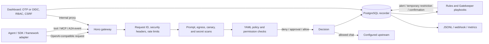

# PhaseOne10841 Technical and Deployment Guide

**Application release:** `0.1.2`
**Repository:** [veracitylife/PhaseOne10841-VI](https://github.com/veracitylife/PhaseOne10841-VI)
**Product:** PhaseOne10841 by Veracity Integrity LLC
**Scope:** Defensive agent security gateway and control plane

This guide describes the current repository implementation: its features, request and event flows, components, configuration, security boundaries, operating procedures, and deployment options. It complements the [main README](../README.md) and the focused references linked throughout.

## 1. Product scope

PhaseOne10841 is an **agent security gateway**, not an endpoint sensor installed inside an operating system. It inspects and controls agent activity that is routed through the gateway or submitted through its enforcement APIs and adapters. Traffic or tool actions that bypass those integration points are outside its view and cannot be blocked by this application.

The product is defensive. Its lab uses inert fixtures and simulated events; it is not an exploit, malware, or offensive testing toolkit.

Typical uses:

- Route OpenAI-compatible chat requests through a policy and inspection layer.
- Evaluate agent tool requests and MCP calls before execution by the integrating agent or tool runner.
- Record sessions, decisions, incidents, and approvals for investigation.
- Export event data for SIEM or operational reporting.
- Apply staged automated responses with Gatekeeper playbooks and human review.

## 2. Feature overview

| Area | What it does | Main implementation |
|---|---|---|
| Chat gateway | OpenAI-compatible model list and chat-completions proxy; mock, OpenAI, Ollama, or OpenRouter upstream | `gateway/src/index.ts`, `gateway/src/upstream/` |
| Prompt and response defenses | Scans prompts and untrusted content for injection indicators; scans egress and tool arguments for secrets and canary values | `gateway/src/enforce.ts`, `gateway/src/scanner.ts`, `shared/src/` |
| Tool and domain policy | Evaluates tool names, destinations, filesystem roots, shell patterns, MCP servers/tools, and destructive actions against YAML policy | `policy/`, `gateway/src/enforce.ts` |
| Human approvals | Holds protected actions for approval; expires pending approvals after the configured timeout | gateway approvals API and dashboard |
| Event recording | Stores agent sessions, events, decisions, approvals, rule hits, and audit data in PostgreSQL | `recorder/src/`, `db/migrations/` |
| Detection and response | Matches YAML rules, aggregation windows, severity, event fields, and playbooks | `rules/`, `gatekeeper/`, `playbooks/` |
| Dashboard | MFA login, admin/viewer roles, session replay, incidents, policy and rule views, approvals, canaries, exports, and operations | `dashboard/src/`, `dashboard/public/` |
| SIEM and monitoring | JSONL/ECS-like event export, optional webhook forwarding, alert webhooks, and Prometheus metrics | `recorder/src/export.ts`, `shared/src/alerting.ts`, `shared/src/metrics.ts` |
| Canary indicators | Uses harmless marker files to detect attempted access or egress; canaries can be signed and rotated | `canaries/`, `shared/src/canary-sign.ts` |
| Agent-to-agent controls | Applies trust classifications and injection scanning to A2A messages | `gateway/src/a2a-firewall.ts` |
| Organization controls | Organization records, scoped policies/playbooks, and hashed API-key support | `shared/src/orgs.ts`, `gateway/src/routes/orgs.ts` |
| Operator interfaces | CLI, local browser GUI, optional operator MCP server, JavaScript and Python client SDKs | `cli/`, `mcp-server/`, `packages/sdk-*` |
| Operations | Onboarding, database migrations, smoke checks, backups/restores, retention, rate-limit status, and Kubernetes manifests | `scripts/`, `deploy/`, `docs/operations.md` |

The repository groups work into product phases. Phases 1–5 provide the proxy, defenses, recording, dashboard, and operating controls. Phase 6 adds operator and SSO integrations. Phase 7 adds Gatekeeper. Phase 8 adds platform and SDK capabilities. The current core application version is `0.1.2`; the separately packaged SDKs have their own package versions.

## 3. Architecture and request flow



### Chat request sequence

1. The client sends `POST /v1/chat/completions` to the gateway. Optional `X-PhaseOne-Agent-Id` and `X-PhaseOne-Session-Id` headers identify the agent and session.
2. Gateway middleware assigns a request ID, adds security headers, and applies rate limits to the configured public-facing route groups.
3. The gateway creates or updates the session, scans the supplied messages for configured prompt-injection and canary/secret indicators, and records decisions as events.
4. Tool calls supplied in the `phaseone_tool_calls` extension are evaluated against the tool policy. A denied request receives a block response; an action requiring human review can return a pending-approval response.
5. If the request is allowed, the gateway forwards it to the selected upstream and records the completion outcome.

The upstream `mock` provider is the safe first-run default and does not need a model-provider credential. Selecting a hosted provider requires its credentials to be injected at runtime.

### Tool, MCP, and A2A sequence

The integrating agent or tool runner submits proposed actions to the enforcement/proxy APIs. PhaseOne returns allow, deny, or approval information and records the decision. An SDK or framework adapter can make this integration easier; installing the SDK alone does not automatically intercept a framework's tools. The caller must route the relevant requests through PhaseOne and honor its decision.

MCP proxy routes apply the MCP server allowlist and tool enforcement before forwarding requests. A2A routes classify the peer and apply the configured trust and injection rules. See [MCP proxy details](mcp-proxy.md) and [SDK guides](sdk-js.md), [Python SDK guide](sdk-python.md).

## 4. Main components

| Component | Responsibility | Runtime / port |
|---|---|---|
| Gateway | Hono HTTP API, proxy, policy enforcement, scanning, recording, and control routes | Node.js, default port `8080` |
| Dashboard | Static UI, OTP/OIDC login, session and CSRF checks, RBAC, and proxy calls to the gateway | Node.js, default port `3000` |
| PostgreSQL | Durable sessions, events, approvals, audit records, rule/playbook outcomes, and organization data | Default Compose service; managed PostgreSQL recommended outside a lab |
| Gatekeeper | Evaluates recorded signals against rule/playbook conditions and performs configured defensive actions | Shared application code and CLI/API triggers; disabled and dry-run by default |
| Operator MCP server | Optional JSON-RPC MCP tools for operational controls; write tools require its admin token | Default bind `127.0.0.1`, default port `8090` |
| CLI | Health, onboarding, smoke checks, migrations, operations, lab, policy/rule work, and Gatekeeper commands | `npm run phaseone -- <command>` |
| SDKs | Client methods and integrations for JavaScript/TypeScript and Python | `packages/sdk-js`, `packages/sdk-python` |

The core is TypeScript using Node.js 20+, Hono, PostgreSQL (`pg`), YAML parsing, and Zod. It is an ECMAScript module project. Containers run as a non-root Node user and execute the TypeScript entrypoints through `tsx`.

## 5. Policy, detection, and action model

### Policy

The baseline is [`policy/default-policy.yaml`](../policy/default-policy.yaml). It configures:

- Outbound domains, tools, shell patterns, HTTP methods, and filesystem roots.
- MCP server/tool allow and deny lists.
- Destructive-action patterns and approval timeout behavior.
- Secret egress and canary behavior.
- Prompt-injection and A2A trust defaults.

Policy is a separate enforcement layer from LLM instructions. Editing a prompt does not replace gateway policy. Use the dashboard's validated policy save path or edit the YAML through a controlled release process. Dashboard policy saves validate allowed keys and preserve a backup of the prior policy.

### Detection rules

Rule files live under `rules/`. They match event fields and can use time-window aggregates such as event counts and distinct values. Use the CLI to list and evaluate rules before relying on them:

```bash
npm run phaseone -- rules list
npm run phaseone -- rules evaluate --event '{"tool_name":"run_shell","decision":"deny"}'
```

See [rule tuning](rules-tuning.md) for rule authoring details.

### Gatekeeper

Gatekeeper follows **Sense → Decide → Act → Learn** when an event is submitted or a cycle is invoked through the supported API/CLI path:

- **Sense:** consumes recorded events, rule hits, severity, decisions, and other supported signals.
- **Decide:** matches a YAML playbook's conditions and execution limits.
- **Act:** runs actions in the playbook's tier.
- **Learn/audit:** records outcomes and exposes recent actions and pending confirmations.

Playbook tiers are `observe` (audit/notify), `contain` (temporary restrictions), and `harden` (higher-impact changes). Hardening actions require an explicit confirmation. Start with `PHASEONE_GATEKEEPER_DRY_RUN=true`; dry-run records the proposed behavior without applying mutations. The optional LLM advisor is advisory: playbooks and the enforcement code determine actions.

See [Gatekeeper operations and schema](gatekeeper.md). Do not enable live mutations until policies, playbooks, approvals, and rollback steps have been reviewed.

Gatekeeper is not a separate always-running service in the Compose stack. Do not assume it continuously polls and processes events unless an operator or deployment has explicitly wired a recurring invocation.

## 6. APIs and operator surfaces

The gateway's baseline API schema is in [`docs/openapi.yaml`](openapi.yaml); endpoint implementations are mounted from `gateway/src/index.ts` and `gateway/src/routes/`.

### Health and monitoring

| Method and path | Purpose |
|---|---|
| `GET /healthz` | Liveness: process is serving requests |
| `GET /readyz` | Readiness: checks PostgreSQL connectivity |
| `GET /health` | Detailed gateway/upstream/database status |
| `GET /metrics` | Prometheus exposition |
| `GET /v1/phaseone/health/detail` | Extended product health information |

### Agent and control APIs

The main route groups implemented in `gateway/src/index.ts` and `gateway/src/routes/` are:

| Group | Paths |
|---|---|
| OpenAI-compatible | `GET /v1/models`; `POST /v1/chat/completions` |
| Enforcement and scanning | `POST /v1/phaseone/tools/enforce`; `POST /v1/phaseone/scan/untrusted`; `POST /v1/phaseone/scan/injection`; `GET /v1/phaseone/scan/injection/rules`; `GET/POST /v1/phaseone/permissions/analyze` |
| MCP and A2A | `POST /v1/mcp/proxy`; `GET /v1/mcp/proxy/allowlist`; `POST /v1/phaseone/a2a/message`; `GET/POST /v1/phaseone/a2a/trust` |
| Events and sessions | `GET/POST /v1/phaseone/events`; `GET /v1/phaseone/sessions`; `GET /v1/phaseone/sessions/:id/timeline`; `GET /v1/phaseone/sessions/:id/replay`; `GET /v1/phaseone/sessions/:id/export.jsonl` |
| Incidents and approvals | `GET /v1/phaseone/stats`; `GET /v1/phaseone/incidents`; `GET /v1/phaseone/approvals`; `GET /v1/phaseone/approvals/:id`; `POST /v1/phaseone/approvals/:id/approve`; `POST /v1/phaseone/approvals/:id/deny` |
| Policy, rules, and canaries | `GET /v1/phaseone/policy`; `GET /v1/phaseone/policy/raw`; `PUT /v1/phaseone/policy`; `PUT /v1/phaseone/policy/v2`; `POST /v1/phaseone/policy/validate`; `GET /v1/phaseone/rules`; `POST /v1/phaseone/rules/evaluate`; `/v1/phaseone/canaries/*` |
| Audit, alerts, exports | `/v1/phaseone/audit`; `/v1/phaseone/alerts/*`; `/v1/phaseone/export/*`; `GET /v1/phaseone/agents`; `GET /v1/phaseone/secrets/patterns` |
| Operations | `GET /v1/phaseone/ops`; `GET /v1/phaseone/retention`; `POST /v1/phaseone/retention/run`; `GET /v1/phaseone/rate-limits`; `GET /v1/phaseone/health/detail`; `GET /v1/phaseone/metrics` |
| Gatekeeper | `/v1/phaseone/gatekeeper/*` for status, configuration, playbooks, event processing, pending confirmations, runtime overrides, simulation, rate caps, effectiveness, and advisor health/configuration |
| Organizations | `/v1/orgs/*` for organization records, events, policy, API key creation, and verification |

The dashboard exposes `/api/*` routes for auth status, OTP/OIDC login/logout, health, session/event views, exports, approvals, policy, A2A trust, canary rotation, alert testing, and Gatekeeper controls. Its authenticated routes proxy to the gateway and enforce session, role, and CSRF checks for mutations. The operator MCP surface is separately documented in [operator-mcp.md](operator-mcp.md). Use the route source and OpenAPI schema together when integrating; the OpenAPI document may not enumerate every newer Phase 8 route.

## 7. Identity, trust boundaries, and security properties

### Dashboard authentication

- Email OTP uses an email allowlist with `admin` and read-only `viewer` roles. SMTP must be configured to deliver codes to users; without SMTP the implementation falls back to a server console/file channel intended only for local testing.
- Optional OIDC provides an authorization-code login path with state and PKCE support. The callback obtains user identity from the provider's TLS-protected userinfo endpoint; unverified ID-token claims are not used as the dashboard identity.
- Sessions are held in process memory. Cookies are `HttpOnly` and `SameSite=Lax`; enable `PHASEONE_SECURE_COOKIES=true` behind HTTPS. Mutating dashboard calls require a CSRF token.
- The dashboard's session, OTP, OIDC pending state, and related rate-limit state are process-local. Keep a single dashboard replica unless the deployment has sticky routing and accepts session loss on restart, or a shared session store is implemented.

Configure OIDC with the variables documented in `.env.example`; for provider-specific notes see [OIDC setup](oidc-setup.md).

### Gateway access is a separate boundary

**Dashboard MFA does not automatically protect direct calls to the gateway.** The gateway API does not apply the dashboard's session/OTP middleware as a global authentication layer. Rate limits, policy checks, CORS, and security headers are not substitutes for caller authentication. Some organization routes use actor identity headers, which must not be treated as proof of identity when supplied by an untrusted client.

For any shared or production deployment:

1. Keep gateway and database services private. Expose only the minimum endpoints required by agent clients.
2. Put an authenticated, TLS-protected edge or service-to-service identity layer in front of gateway APIs; restrict administrative/control endpoints to trusted operators.
3. Do not trust `X-PhaseOne-Actor-Email`, agent IDs, forwarded IP headers, or similar client-supplied headers unless a trusted proxy strips and sets them.
4. Do not expose PostgreSQL to the public internet. Restrict DB credentials to the app and migration processes.
5. Do not use Compose's sample database configuration in production. It contains lab credentials and publishes the database port.
6. Use a secret manager. For this environment, keep secret values in OpenClaw Vault and inject them at runtime by a safe mapping. Do not commit secrets, put them in Helm values, or echo them in deployment commands.

Before a public deployment, review `deploy/` values and ingress settings for your actual cluster, identity proxy, TLS, network policies, persistence, and secret synchronization. The repository's production overlays contain environment placeholders and should not be applied unchanged.

### Other controls and limitations

- Gateway API rate limiting is in-memory and per process; it is abuse control, not authentication or a cluster-wide quota.
- Sessions/events and related operational records use PostgreSQL. Policy/rules/playbooks/canaries are also file-backed and must be persisted or shipped with the image as appropriate.
- Metrics counters, Gatekeeper runtime overrides, and dashboard sessions are process-local. Multiple gateway replicas do not share those in-memory values.
- Canaries are harmless indicators, not a replacement for endpoint protection or secret management.
- A deny or approval decision only protects the action if the connected agent/tool runner routes the action through PhaseOne and obeys the response.
- Backups contain potentially sensitive event and configuration data. Restrict their access and retention.

## 8. Configuration reference

The full sample key list is in [`.env.example`](../.env.example). The onboarding command is `npm run onboard`; it writes a local `.env` file and can generate a session secret. In Vault-only environments, do not persist production secret values in that file: use the approved Vault-to-runtime mapping instead. `.env` files, credentials, and backups must stay out of Git.

| Variable group | Important names | Notes |
|---|---|---|
| Identity | `PHASEONE_ADMIN_EMAILS`, `PHASEONE_VIEWER_EMAILS`, `PHASEONE_DASHBOARD_AUTH`, `PHASEONE_SESSION_SECRET`, `PHASEONE_SESSION_TTL_MS`, `PHASEONE_SECURE_COOKIES` | Auth defaults on; use real allowlisted identities and a strong Vault-provided session secret. |
| OTP / SMTP | `SMTP_HOST`, `SMTP_PORT`, `SMTP_USER`, `SMTP_PASS`, `SMTP_FROM`, `SMTP_SECURE`, `PHASEONE_OTP_TTL_MS`, `PHASEONE_OTP_RATE_LIMIT`, `PHASEONE_OTP_RATE_WINDOW_MS` | No SMTP means test-only console/file fallback. Never use that fallback for shared service. |
| OIDC | `PHASEONE_OIDC_ENABLED`, `PHASEONE_OIDC_ISSUER`, `PHASEONE_OIDC_CLIENT_ID`, `PHASEONE_OIDC_CLIENT_SECRET`, `PHASEONE_OIDC_REDIRECT_URI`, `PHASEONE_OIDC_SCOPES`, `PHASEONE_OIDC_*_ENDPOINT`, role-claim/mapping options | Client secret is a secret; set redirect URI to the public HTTPS callback. Keep OTP fallback policy deliberate. |
| Upstream | `UPSTREAM_PROVIDER`, `OPENAI_API_KEY`, `OPENAI_BASE_URL`, `OPENROUTER_API_KEY`, `OPENROUTER_BASE_URL`, `OLLAMA_BASE_URL` | Start with `mock`. Provider API keys belong in Vault and should be available only to the gateway. Provider quota/billing errors are different from gateway build or authentication errors. |
| Database / ports | `DATABASE_URL`, `GATEWAY_PORT`, `DASHBOARD_PORT`, `GATEWAY_URL` | Compose injects container-specific URLs. Use a managed Postgres URI via a secret mapping outside the lab. |
| Policy / events | `PHASEONE_POLICY_PATH`, `PHASEONE_RULES_DIR`, `PHASEONE_APPROVAL_TIMEOUT_MS`, `PHASEONE_SIEM_WEBHOOK_URL`, `PHASEONE_ALERT_WEBHOOK_URL`, `PHASEONE_METRICS_ENABLED` | Keep webhook URLs private if they contain access credentials. |
| Operations | `PHASEONE_RETENTION_DAYS`, `PHASEONE_RETENTION_PRUNE_*`, `PHASEONE_API_RATE_LIMIT`, `PHASEONE_API_RATE_WINDOW_MS`, `PHASEONE_BACKUP_DIR` | Run retention dry-run first. Rate limits are process-local. |
| Gatekeeper | `PHASEONE_GATEKEEPER_ENABLED`, `PHASEONE_GATEKEEPER_DRY_RUN`, `PHASEONE_PLAYBOOKS_DIR`, poll/window/cap options | Disabled and dry-run by default. Review [gatekeeper.md](gatekeeper.md). |
| Operator MCP | `PHASEONE_OPERATOR_MCP_HOST`, `PHASEONE_OPERATOR_MCP_PORT`, `PHASEONE_OPERATOR_MCP_TOKEN` | Keep the server bound to localhost/private network; token authorizes write tools. |

Avoid enabling `PHASEONE_DASHBOARD_AUTH=false` except for an isolated local demonstration. Never set wildcard admin access on a shared deployment.

## 9. Deploy locally with Docker Compose

This route is for development and isolated evaluation. The committed Compose file uses lab database credentials and publishes PostgreSQL, gateway, and dashboard ports on the host. Do not expose that configuration to an untrusted network or treat it as a hardened production deployment.

### Prerequisites

- Docker Engine with the Compose v2 plugin.
- Node.js 20+ and npm if running onboarding, migrations, tests, or CLI tasks on the host.
- Git and access to this repository.

### Build, initialize, and start

```bash
git clone https://github.com/veracitylife/PhaseOne10841-VI.git
cd PhaseOne10841-VI
npm ci
```

The onboarding utility is `npm run onboard`; it writes `.env` and can persist a generated session secret there. In environments with Vault-only secret handling, do not use that file as a secret store: provide the required value using the approved Vault-to-runtime mapping. Never enter provider API keys in a tracked file or deployment manifest. The commands below assume the session secret is injected into the current runtime environment without being printed or saved in the repository.

Build the images and start PostgreSQL. Compose initializes the original schema files for a new volume. Then run the application migrator in the gateway container; it applies any remaining/current migrations and is required when upgrading an existing database:

```bash
docker compose build
docker compose up -d postgres
docker compose run --rm gateway npm run migrate
docker compose up -d
docker compose ps
```

The sample stack starts with `UPSTREAM_PROVIDER=mock`. Verify health and behavior before switching an upstream:

```bash
curl -fsS http://localhost:8080/healthz
curl -fsS http://localhost:8080/readyz
curl -fsS http://localhost:3000/healthz
npm run smoke
```

Expected gateway readiness includes a ready status and healthy database. Then run the test suite and build when validating a source checkout:

```bash
npm test
npm run build
```

Open the dashboard on port `3000` and log in with an allowlisted email. Configure SMTP for email delivery; console/file OTP fallback is lab-only. Gateway port `8080` is the agent integration endpoint. Do not confuse the dashboard's login protection with direct gateway API authentication.

### Select an upstream

Keep `mock` until the health checks pass. To use OpenAI, Ollama, or OpenRouter, select the provider and inject the associated URL/key through the runtime secret mapping, then recreate the gateway. For example, with environment values already injected into the current shell:

```bash
UPSTREAM_PROVIDER=openai docker compose up -d --force-recreate gateway
```

Do not put the literal provider key into shell history, command output, source control, or a compose override committed to Git. The app routes requests to the upstream; upstream provider quota/billing and provider-side model permissions remain external dependencies.

## 10. Deploy on Kubernetes

The repository provides a Helm chart at `deploy/helm/phaseone` and Kustomize overlays at `deploy/kustomize/`. For shared/production deployment, use an external managed PostgreSQL database, a private secret source, internal ClusterIP services, and an authenticated TLS ingress. The bundled embedded Postgres is for a lab only.

### Prepare the image

Build and publish the current version to a registry accessible to the cluster:

```bash
docker build -t REGISTRY/phaseone:0.1.2 .
docker push REGISTRY/phaseone:0.1.2
```

Replace `REGISTRY` with your actual registry. The image currently runs TypeScript entrypoints through `tsx`; run CI and verify the root build before publishing an image. Do not infer successful compilation only from `docker build`: the current Dockerfile's TypeScript build line is permissive. CI is the authoritative build/test gate.

### Prepare runtime secrets and database

1. Provision PostgreSQL and restrict network access to the gateway and the controlled migration runner.
2. Create/synchronize a Kubernetes Secret named for example `phaseone-secrets` from the approved secret manager. Required values include `DATABASE_URL`, `PHASEONE_SESSION_SECRET`, and `PHASEONE_ADMIN_EMAILS`. Add SMTP, upstream provider, OIDC, and webhook values only when those features are enabled.
3. Keep the secret resource out of Git and Helm values. In this environment, use the OpenClaw Vault as the secret source and a safe runtime mapping; do not paste raw values into `kubectl` arguments.
4. Run `npm run migrate` from a trusted runner that can reach the same database and has `DATABASE_URL` injected through the secret mapping. The app does not run SQL migrations automatically on every service startup.

### Install with Helm

First render and review the manifests. Keep ingress disabled until the real hostname, TLS secret, and edge authentication are configured:

```bash
helm template phaseone deploy/helm/phaseone \
  --namespace phaseone \
  --set image.repository=REGISTRY/phaseone \
  --set image.tag=0.1.2 \
  --set config.PHASEONE_DASHBOARD_AUTH=true \
  --set config.PHASEONE_SECURE_COOKIES=true \
  --set postgres.enabled=false \
  --set existingSecret.create=false \
  --set existingSecret.name=phaseone-secrets \
  --set database.externalUrlSecret.name=phaseone-secrets \
  --set database.externalUrlSecret.key=DATABASE_URL
```

After reviewing the rendered output and ensuring `phaseone-secrets` exists, install with the same values:

```bash
helm upgrade --install phaseone deploy/helm/phaseone \
  --namespace phaseone --create-namespace \
  --set image.repository=REGISTRY/phaseone \
  --set image.tag=0.1.2 \
  --set config.PHASEONE_DASHBOARD_AUTH=true \
  --set config.PHASEONE_SECURE_COOKIES=true \
  --set postgres.enabled=false \
  --set existingSecret.create=false \
  --set existingSecret.name=phaseone-secrets \
  --set database.externalUrlSecret.name=phaseone-secrets \
  --set database.externalUrlSecret.key=DATABASE_URL
```

The chart defaults to one gateway and one dashboard replica. Keep one dashboard replica: session and OTP state is process-local. Multiple gateway replicas also have independent in-memory rate counters, metrics, and Gatekeeper runtime overrides. Configure a persistent/shared design before increasing replica counts. Configure ingress and TLS for your actual cluster separately; sample hostnames and TLS secret names are placeholders.

### Kustomize

Use Kustomize only after supplying real image names, an existing secret, external database details, and cluster-specific TLS/ingress configuration. Render before applying:

```bash
kubectl kustomize deploy/kustomize/overlays/prod
```

The production overlay includes placeholder hosts/TLS and a multi-replica setting; it is not safe to apply unchanged. Review every rendered resource, especially its replica counts, secrets, ingress, external DB patch, backup storage, and network controls.

### Post-deploy validation

```bash
kubectl -n phaseone get deploy,pods,svc,ingress
kubectl -n phaseone rollout status deployment/phaseone-gateway
kubectl -n phaseone rollout status deployment/phaseone-dashboard
kubectl -n phaseone logs deployment/phaseone-gateway --tail=100
```

Check the service endpoints from inside the cluster or through the configured trusted edge. Confirm liveness/readiness, database connectivity, OTP delivery, dashboard session behavior, policy decisions, event persistence, and alert/export integrations before routing agents to the deployment.

## 11. Operations, backup, updates, rollback

### CLI and health checks

```bash
npm run phaseone -- help
npm run phaseone -- health
npm run phaseone -- smoke
npm run phaseone -- gatekeeper status
npm run phaseone -- gatekeeper dry-run
```

Full command usage: [CLI reference](cli.md). The dashboard's Ops view and `/v1/phaseone/rate-limits` expose selected runtime configuration.

### Retention

Start with a dry-run and review counts before applying:

```bash
npm run retention -- --dry-run --days 30
npm run retention -- --execute --days 30
```

The API retention action defaults to dry-run. Deletion is destructive; ensure backups and retention requirements are understood before execution.

### Backup and restore

```bash
npm run backup
npm run restore -- backups/TIMESTAMP
```

Backups contain a PostgreSQL dump plus policy/rule files. Restore replaces database contents and may overwrite the current policy. Use a verified backup and follow the restore script's explicit confirmation. Store backups in access-controlled, encrypted storage with a tested retention schedule. See [operations](operations.md).

### Upgrade

1. Read the release notes and compare configuration/schema changes.
2. Take and verify a database/configuration backup.
3. Build/test the candidate and publish the image under an immutable version tag.
4. Apply database migrations once using the controlled migration runner.
5. Roll out the application and verify health, logs, dashboard login, and a harmless mock-policy test.
6. Keep the prior image tag and backup available until validation completes.

### Rollback

For Kubernetes, roll back the previous Helm revision or image tag only after determining whether a database migration is backward-compatible. For Docker Compose, restore the prior image/source version and recreate the affected service. Database restore is a separate destructive operation; do it only from a verified backup and with explicit operator intent.

## 12. Development and CI

The root project requires Node.js 20+. The standard checks are:

```bash
npm ci
npm test
npm run build
```

JavaScript SDK checks:

```bash
cd packages/sdk-js
npm install --no-package-lock
npm test
npm run build
```

Python SDK checks:

```bash
cd packages/sdk-python
python -m pip install -e ".[dev]"
python -m pytest tests/
python -m build
```

`.github/workflows/ci.yml` runs core tests/build, both SDK test/build paths, PHP handler lint, and the root package version check for pull requests and pushes to `main`. SDK publishing remains a separate manual workflow and requires the appropriate repository publishing secrets. Publishing is an external side effect; use dry-run validation before a real publish.

## 13. Troubleshooting

| Symptom | Check |
|---|---|
| Gateway `/readyz` is not ready | Check PostgreSQL health, `DATABASE_URL` injection, networking, and whether migrations completed. |
| `/healthz` works but `/readyz` fails | The process is live, but its database dependency is unavailable. |
| Dashboard OTP does not arrive | Configure SMTP and verify delivery settings; console/file fallback is only for an isolated lab. |
| Dashboard login succeeds but mutations fail | Check admin/viewer allowlists, CSRF cookie/header, secure-cookie HTTPS setup, and role permissions. |
| Model requests fail after changing upstream | Verify provider selection, runtime secret mapping, base URL, network access, model availability, and provider quota. Mock first to separate gateway health from upstream billing/quota. |
| Requests bypass policy | Confirm the agent's model URL and every tool/MCP execution path point to PhaseOne and that the caller honors block/approval responses. |
| Gatekeeper appears inactive | It is disabled by default. Check enabled/dry-run status, event/rule matches, playbook path, cooldown, and pending harden confirmation. |
| Sessions disappear after restart or land inconsistently | Dashboard sessions are held in process memory. Use one replica and expect restart to invalidate sessions. |
| Metrics/rate counters differ between replicas | These values are process-local; they are not cluster-wide shared counters. |

## 14. Reference map

- Main entry point and local Compose setup: [`README.md`](../README.md)
- OpenAPI baseline: [`openapi.yaml`](openapi.yaml)
- Operations, retention, rate limits, and backups: [`operations.md`](operations.md)
- Kubernetes and Helm values: [`kubernetes.md`](kubernetes.md), [`deploy/helm/phaseone`](../deploy/helm/phaseone)
- OIDC details: [`oidc-setup.md`](oidc-setup.md)
- Gatekeeper playbooks: [`gatekeeper.md`](gatekeeper.md)
- CLI commands: [`cli.md`](cli.md)
- MCP proxy: [`mcp-proxy.md`](mcp-proxy.md)
- Operator MCP: [`operator-mcp.md`](operator-mcp.md)
- JavaScript SDK: [`sdk-js.md`](sdk-js.md)
- Python SDK: [`sdk-python.md`](sdk-python.md)
- Environment sample: [`.env.example`](../.env.example)
